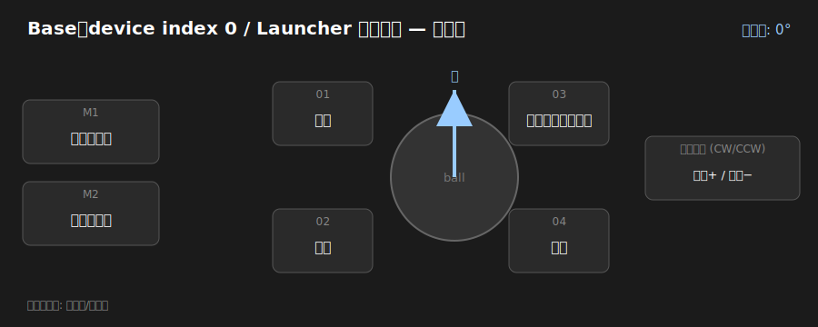
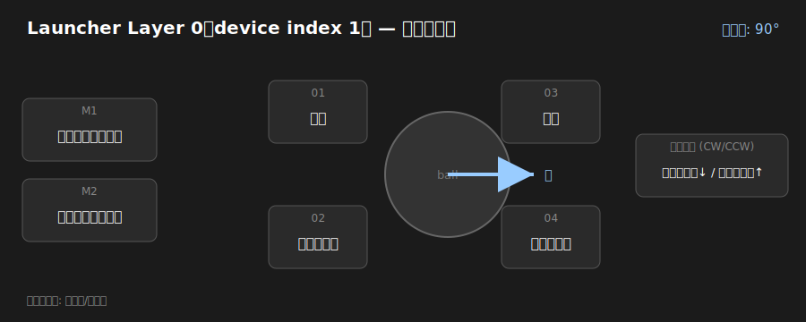
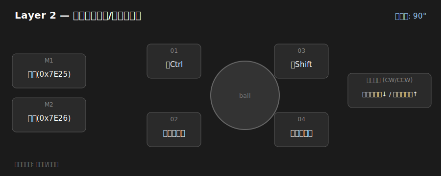
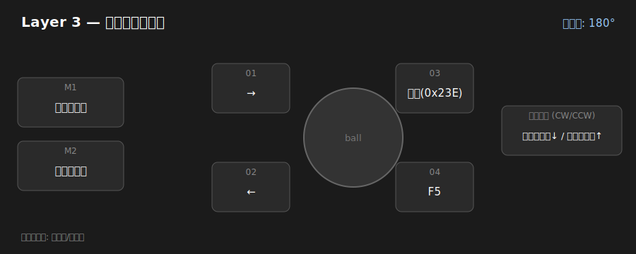
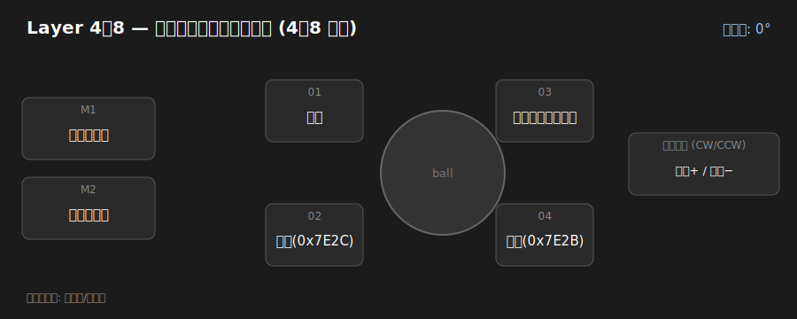

# テーマ: Main / Side and Presentation

Nape Pro を**唯一のメインポインティングデバイス**として使うことを前提にした設定プロファイル。
**横置き・横置き（設定用）・プレゼン縦持ち**の 3 つの持ち方をカバーし、
**ジェスチャとスクロールを使いやすく**することを狙う。

| 項目 | 値 |
|------|----|
| コンフィグ | [`nape-pro-settings-2026-06-28.json`](nape-pro-settings-2026-06-28.json)（スキーマ v1.2 / 全項目収録）|
| エクスポート日 | 2026-06-28 |
| ファームウェア | `010205...`（v1.2.5 系）/ Launcher 1.3.8 |
| レイヤー数 | 9（うち実質 0〜3 が個別。4〜8 は同一）|
| DPI | 400 / 800 / 1600 / 3200 / 4000（現在 1600）|
| 回転角 | 全体 90° / Layer1 90° / Layer2 90° / Layer3 180° / 他 0° |
| その他 | ポーリング 1000Hz / スリープ 600秒 / 常時モード OFF |

復元方法は [`../../tools/README.md`](../../tools/README.md) のインポート手順を参照。
全 HID コマンド仕様は [`../../docs/nape-pro-hid-protocol.md`](../../docs/nape-pro-hid-protocol.md)。

> ℹ️ このファイルは v1.2 で再エクスポート済み。回転角・常時モード・スリープ・ポーリングを含む全項目を
> エクスポート/インポートで復元できる（バッテリーは参照のみ）。各レイヤ図に回転角も表示。

> デバイス概要・物理レイアウト・OctaShift・**レイヤ番号のズレ（表示 vs 内部）** は
> [`../../docs/nape-pro-device.md`](../../docs/nape-pro-device.md) を参照。本テーマの「横置き／横置き設定用／
> プレゼン縦持ち」は、OctaShift が向きに応じて切り替える各レイヤに対応する。

## テーマのコンセプト

- **横置き（メイン）**: ラップトップ風に手前へ置いた通常操作。左右クリック＋戻る／進む＋ホイールスクロール。
- **横置き（設定用）**: 修飾キー（Ctrl/Shift）やジェスチャを併用し、ズーム・横スクロール等の調整操作を行う。
- **プレゼン縦持ち**: 縦に持ち替えてプレゼンのページ送り。**F5 でスライドショー開始、←/→ でページ送り**。
- マウスを別途持たず、**これ 1 台で完結**させる前提。スクロールとジェスチャを最優先に配置。

## レイヤごとの解説図

各図は現在のコンフィグを実機レイアウトに重ねたもの（[`tools/build-layer-diagrams.js`](../../tools/build-layer-diagrams.js) で生成）。
見出しは **device VIA index（Launcher 表示番号）** の順。ボール上の青い矢印は回転角に応じた「上方向」
（実機確認: 0°=03/04側, 90°=01/03側, 180°=01/02側, 270°=02/04側）。
レイヤ番号のズレは [`../../docs/nape-pro-device.md`](../../docs/nape-pro-device.md) 参照。

### Base（device index 0 / Launcher 非表示）

### Launcher Layer 0（device index 1）— フルマウス
実機写真の既定レイアウト。

### Launcher Layer 1（device index 2）— 設定/ジェスチャ
左Ctrl / 左Shift を併用し、`Ctrl+ホイール`でズーム、`Shift+ホイール`で横スクロール等の調整操作向け。

### Launcher Layer 2（device index 3）— プレゼン
F5 でスライドショー開始、←/→ でページ送り。

### Launcher Layer 3〜7（device index 4〜8）— 基本ポインタ（同一）

## レイヤ一覧表

`独自(0x____)` は Keychron 独自コード。実機ラベルから `0x5229=ボールジェスチャ`, `0x522A=ボールスクロール`,
`0x522B=モード/レイヤ（全レイヤ共通）` が判明。`0x7Exx`・`0x023E` は未解読（ジェスチャ系と推定）。

| idx | Launcher | 役割 | 回転角 | M1 | M2 | 01 | 02 | 03 | 04 | ホイール CW/CCW |
|----|----------|------|-------|----|----|----|----|----|----|-----------------|
| 0 | （base）| ベース | 0° | 左クリック | 右クリック | 戻る | なし | ボールスクロール | なし | 音量+/− |
| 1 | Layer 0 | フルマウス | 90° | ボールジェスチャ | ボールスクロール | 戻る | 左クリック | 進む | 右クリック | スクロール↓/↑ |
| 2 | Layer 1 | 設定/ジェスチャ | 90° | 独自(0x7E25) | 独自(0x7E26) | 左Ctrl | 左クリック | 左Shift | 右クリック | スクロール↓/↑ |
| 3 | Layer 2 | プレゼン | 180° | 左クリック | 右クリック | → | ← | 独自(0x023E) | F5 | スクロール↓/↑ |
| 4〜8 | Layer 3〜7 | 基本ポインタ | 0° | 左クリック | 右クリック | 戻る | 独自(0x7E2C) | ボールスクロール | 独自(0x7E2B) | 音量+/− |

> device index 1（Launcher Layer 0）は実機写真の既定割当と一致する。
> 予備ボタン（Col6）は全レイヤで `モード/レイヤ (0x522B)`。OctaShift の向き切替に関わると推定。
> レイヤ番号のズレ（表示 vs 内部）は [`../../docs/nape-pro-device.md`](../../docs/nape-pro-device.md) を参照。

## 既知の制限

- バッテリー残量は参照情報のため書き戻さない（設定ではない）。
- `0x7Exx` / `0x023E` のカスタムコードは人間可読名が未解読（動作には影響しない）。

## メモ

- device index 4〜8（Launcher Layer 3〜7）が同一なのは予備（未使用）と思われる。
- デバイス共通情報（概要・物理レイアウト・レイヤ番号のズレ・出典）は
  [`../../docs/nape-pro-device.md`](../../docs/nape-pro-device.md) に集約。
